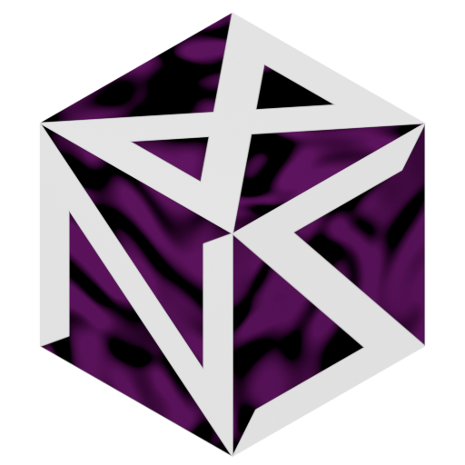

<div align="center">



# Hypr3D =^..^=

**A new perspective on window management - literally.**
A Hyprland plugin that turns your workspace into a walkable 3D space

[Installation](#installation) · [Use](#use) · [Configuration](#configuration) · [Report a bug / suggest a new feature](https://github.com/samine825/Hypr3D/issues)


</div>

# <a name="installation"></a> Installation
## Hyprpm

```bash
# Install latest
hyprpm add https://github.com/samine825/Hypr3D
hyprpm enable Hypr3D

# Update
hyprpm update
```


## Manual

```bash
# Build
cmake -S . -B build -DHYPRLAND_HEADERS=/var/cache/hyprpm/$USER/headersRoot
cmake --build build -j$(nproc)

# Load
hyprctl plugin load "$PWD/build/hypr3d.so"
```

# <a name="use"></a> Use

To enable 3D:

```bash
hyprctl eval 'hl.plugin.hypr3d.toggle()'
```

Or bind in lua config:

```lua
hl.bind("SUPER + F12", hl.plugin.hypr3d.toggle)
```

## Controls

| Input                         | Action                                         |
| -------------------------------| ------------------------------------------------|
| Mouse move                    | Look around                                    |
| WASD                          | Move                                           |
| Space                         | Move up (flying) / Jump                        |
| Shift                         | Move down (flying)                             |
| Ctrl                          | Sprint                                         |
| C                             | Zoom, wheel adjusts                            |
| Super + Left click            | Drag window                                    |
| Super + Right click           | Resize window                                  |
| Super + Mouse wheel click     | rotate window                                  |
| Super + Mouse wheel scrolling | Zoom window                                    |
| Super + Left Alt              | Toggle keyboard mode (movement / window input) |
| F3                            | Toggle debug HUD                               |
| F5                            | Switch camera view                             |

# <a name="configuration"></a> Configuration

## Lua config example:

```lua
if hl.plugin.hypr3d then
    hl.bind("SUPER + F12", hl.plugin.hypr3d.toggle)
    hl.plugin.hypr3d.config({
        world = {
            panorama = "~/panorama.png",
            grid = false,
        },
        windows = {
            window_scale = 0.25,
            spawn_distance = 2,
        },
        player = {
            mesh = {
                path = "~/player.gltf",
                transform = {
                    rotation = {0, 90, 0},
                    scale =    {1.5, 1.5, 1.5},
                },
                emissive_scale = 1.0,
                flat = true,
                center = "origin",
            },
            animations = {
                idle = {source = "Idle"},
                walk = {source = "Walking"},
                run = {source = 2},
                jump = {source = 3, duration_scale=2.4},
            },
            collision = true,
            move_speed = 1.5,
            spawn = {0, 67, 0},
            flying = false,
            walk_bob = true
        },
        scene = {
            mymap = {
                mesh = {
                    path = "~/scene.gltf",
                    transform = {
                        position = {1, 0, 0},
                    },
                    emissive_scale = 1.0,
                    center_offset = {0, 34, 0},
                },
                collision = true,
                static = true,
            },
            anyname = {
                mesh = {
                    path = "eevee.gltf",
                    transform = {
                        position = {y = 3},
                        scale =    {2, 2, 2},
                    },
                    emissive_scale = 1.0,
                    flat = true,
                    center = "origin",
                    center_offset = {0, 20, 0},
                },
                collision = true,
                static = false,
                physics = true,
            },
        }
    })
end
```


## Parameters

Everything is optional -- only set what you want to change. 

### World

| Option   | Type   | Default | Description                             |
| ----------| --------| ---------| -----------------------------------------|
| panorama | string | ""      | 360° background image (equirectangular) |
| grid     | bool   | true    | the starting 40x40 platform             |
| monitor  | string | ""      | render the 3D view on this monitor (e.g. "DP-1") instead of the focused one |
| tools    | bool   | false   | tool slots on keys 1-5 with a HUD bar: 1 cursor (default, no HUD), 2 curve and 3 lines draw closed paths on the ground (left-click adds a point, right-click removes one, clicking a point converts it, pressing the tool's key again starts a new path); a character dropped onto a path walks it |

### Windows

| Option         | Type  | Default | Description                             |
| ----------------| -------| ---------| -----------------------------------------|
| window_scale   | float | 0.5     | window size multiplier (at 100 px/m)    |
| spawn_distance | float | 5.0     | how far from you new windows appear (m) |
| depth          | float | 0.05    | window slab thickness in world units (0 = flat quads); the walls follow the window's rounded corners and are painted with the texture's edge colors |

### Player

| Option           | Type                                | Default     | Description                                             |
| ------------------| -------------------------------------| -------------| ---------------------------------------------------------|
| mesh             | [Mesh](#mesh)                       | {}          | object's visual                                         |
| animations       | [Animation Group](#animation-group) | {}          | which clip each movement state plays                    |
| look_sensitivity | float                               | 0.0025      | how fast the camera turns (radians per pointer count)   |
| look_inertia     | float                               | 0.03        | camera coasting after you stop the mouse (in seconds)   |
| move_inertia     | float                               | 0.05        | coasting after you stop walking in seconds (in seconds) |
| move_speed       | float                               | 4.0         | how fast you walk (m/s, running - 2.5x)                 |
| spawn            | [Vector3](#vector3)                 | { 0, 0, 0 } | player spawn point                                      |
| flying           | bool                                | true        | disables falling                                        |
| walk_bob         | bool                                | true        | simulate the rhythm of walking                          |
| collision        | bool                                | true        | whether body collides with the world                    |

### Scene

| Option          | Type                          | Default | Description                        |
| -----------------| -------------------------------| ---------| ------------------------------------|
| any unique name | [Scene Object](#scene-object) | {}      | u can place any number of objects. |

### <a name="scene-object"></a> Scene Object

| Option    | Type          | Default | Description                                          |
| -----------| ---------------| ---------| ------------------------------------------------------|
| mesh      | [Mesh](#mesh) | {}      | object's visual                                      |
| collision | bool          | true    | whether body collides with the world                 |
| static    | bool          | true    | you can't pick it up and carry it; suitable for maps |
| physics   | bool          | false   | enable jolt physics (only if static=false)           |

Want only part of a model to be solid? Rename those nodes in Blender to
start with `nocol` -- they'll still render, but you'll walk right through.

### <a name="characters"></a> Characters

`characters = { name = { ... }, ... }`: animated (skinned) glTF models that
play their clips in place. Each time a clip ends, one of the `idle` clips is
picked at random (never the same one twice in a row when there's a choice) and
crossfaded in. Each stands in an upright, flat-bottomed collision cylinder on
its feet position; Super + left-drag carries it (it stays upright, keeps
animating, faces you, and its feet follow the ground under the crosshair).

| Option    | Type                         | Default  | Description                                   |
| -----------| ------------------------------| ----------| -----------------------------------------------|
| path      | string                       | ""       | the model file (.glb/.gltf) with its animations |
| transform | [transform](#transform)      |          | position of the feet, rotation, scale         |
| flat      | bool                         | false    | raw texture, no headlight shading             |
| idle      | list of strings              | all      | clip names to pick between                    |
| radius    | float                        | 0.3      | collision cylinder radius (m)                 |
| height    | float                        | 1.8      | collision cylinder height (m)                 |
| walk      | string                       | "walk"   | clip played while walking a path              |
| run       | string                       | "run"    | clip played while running a path              |

Mixamo exports the character and each animation as separate FBX files.
`tools/mixamo2glb.py` merges them into one `.glb` with a named animation per
clip (Blender 4.4+):

```sh
blender -b -P tools/mixamo2glb.py -- path/to/mixamo-folder out.glb
```

The folder holds `character.fbx` plus the animation FBXs (or a
`character.json` listing them); each clip is named after its file
(`idle.alt1.fbx` → `idle.alt1`).

### <a name="tools"></a> Tools and paths

With `world.tools = true`, keys **1-5** (in movement mode; Super + digit is left
to the compositor) pick a tool. The slot bar at the bottom of the view shows
only while a path tool is out, and paths show only then -- or while carrying a
character, so you can see where to drop it:

| Key | Tool    | Use |
| ----| --------| ----|
| 1   | cursor  | the default: the crosshair, no HUD, paths hidden |
| 2   | curve   | left-click drops a **smooth** point (a circle) on the ground under the crosshair |
| 3   | lines   | left-click drops a **sharp** point (a square): a corner |

- **Paths close themselves:** new points go after the end (orange ring), just before the start (green ring and a chevron showing the direction).
- **Mixing:** the curve bends through smooth points and turns sharp at square ones, so one path can mix curves and straight runs.
- **Clicking an existing point** converts it to the tool's type, and makes its path the one new points go to.
- **Right-click** deletes the point under the crosshair, else the active path's last one. A path without points is gone.
- **Pressing the active tool's key again** starts a new path. The slot reads `NEW` until the first point, then `P<n>`.
- **Lifetime:** paths live in plugin memory until a reload.

**Walking.** Super + left-drag a character and drop it within 0.6 m of a path. It walks the path in a loop, in the path's direction, playing its `walk` clip, following the drawn curve with its feet on the ground and turning to face the way it goes.
- **Speed:** it advances by the clip's own root motion, so the stride matches the travel.
- **Running:** double left-click it to switch between walking and running (`run` clip).
- **Stopping:** picking it up takes it off the path.

### <a name="mesh"></a> Mesh

| Option         | Type                    | Default   | Description                         |
| ----------------| -------------------------| -----------| -------------------------------------|
| path           | string                  | ""        | the model file to load (.glb/.gltf) |
| transform      | [Transform](#transform) | {}        | idk                                 |
| emissive_scale | float                   | 1.0       | how bright the model's own light is |
| flat           | bool                    | false     | trust the model's lighting as-is    |
| center         | string                  | logical   | origin / logical                    |
| center_offset  | [Vector3](#vector3)     | {0, 0, 0} | Extra shift of the rotation pivot   |

### <a name="animation-group"></a> Animation Group

| Option | Type                    | Default |
| --------| -------------------------| ---------|
| idle   | [Animation](#animation) | {}      |
| walk   | [Animation](#animation) | {}      |
| run    | [Animation](#animation) | {}      |
| jump   | [Animation](#animation) | {}      |

### <a name="animation"></a> Animation

| Option         | Type       | Default | Description                                                       |
| ----------------| ------------| ---------| -------------------------------------------------------------------|
| source         | int/string | {}      | which anim to play: its name in the file, or its zero-based index |
| duration_scale | float      | 1.0     | playback speed multiplier                                         |

### <a name="transform"></a> Transform

| Option   | Type                | Default   |
| ----------| ---------------------| -----------|
| position | [Vector3](#vector3) | {0, 0, 0} |
| rotation | [Vector3](#vector3) | {0, 0, 0} |
| scale    | [Vector3](#vector3) | {1, 1, 1} |

### <a name="vector3"></a> Vector3

Vectors can be written either way: `{ x = 1, y = 2, z = 3 }` or just `{ 1, 2, 3 }`.

# Screenshots
<table>
  <tr>
    <td align="center" width="25%"></a></td>
    <td align="center" width="25%"></a></td>
  </tr>
  <tr>
    <td align="center" width="25%"></a></td>
    <td align="center" width="25%"></a></td>
  </tr>
<tr>
    <td align="center" width="25%"></a></td>
    <td align="center" width="25%"></a></td>
  </tr>
</table>
